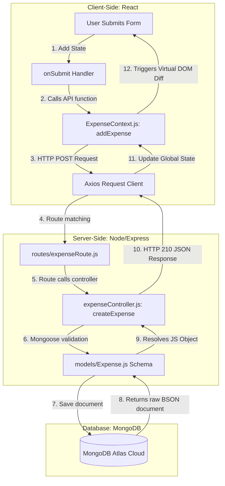
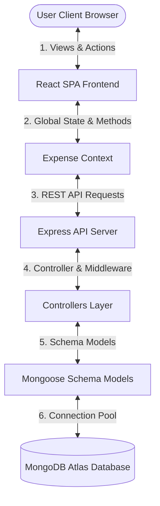
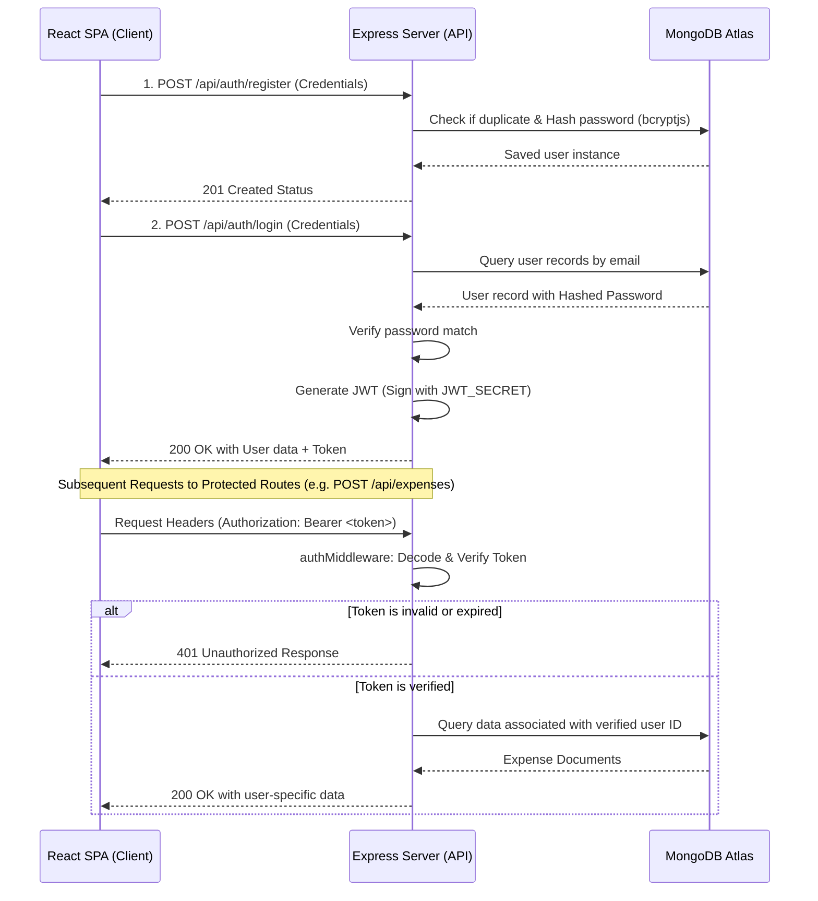

# 💸 Muneem - Smart Full-Stack Expense Tracker

[](https://reactjs.org/)
[](https://vitejs.dev/)
[](https://tailwindcss.com/)
[](https://nodejs.org/)
[](https://expressjs.com/)
[](https://www.mongodb.com/)
[](https://jwt.io/)
[](https://vercel.com/)
[](https://render.com/)

Muneem is a professional, responsive, and robust full-stack expense tracking web application. It enables users to record transactions, categorize expenditures, filter entries dynamically, and visualize financial habits in real-time through clean interactive analytics. Built with a modern, high-performance architecture, Muneem is structured to serve as an impressive portfolio piece demonstrating industry-standard engineering patterns.

---

## 🚀 Live Demo & API Links

*   **Frontend Client (Vercel):** [https://expense-tracker-ten-puce-15.vercel.app](https://expense-tracker-ten-puce-15.vercel.app)
*   **Backend Server (Render):** [https://expense-tracker-p9nk.onrender.com](https://expense-tracker-p9nk.onrender.com)

---

## 📖 Table of Contents
1.  [Project Description](#-project-description)
2.  [Features](#-features)
3.  [Tech Stack](#-tech-stack)
4.  [Folder Structure](#-folder-structure)
5.  [System Design Overview](#-system-design-overview)
6.  [Project Workflow & How It Works](#-project-workflow--how-it-works)
7.  [Frontend to Backend Communication](#-frontend-to-backend-communication)
8.  [How Data Flows in the Application](#-how-data-flows-in-the-application)
9.  [Architecture Flow](#-architecture-flow)
10. [API Flow Explanation & Request-Response Cycle](#-api-flow-explanation--request-response-cycle)
11. [Authentication Flow (JWT)](#-authentication-flow-jwt)
12. [Environment Variables](#-environment-variables)
13. [Installation Steps](#-installation-steps)
14. [Running Project Locally](#-running-project-locally)
15. [Deployment Steps](#-deployment-steps)
16. [Screenshots](#-screenshots)
17. [Challenges Faced](#-challenges-faced)
18. [Learning Outcomes](#-learning-outcomes)
19. [Future Improvements](#-future-improvements)
20. [Contributing](#-contributing)
21. [License](#-license)
22. [Author Information](#-author-information)

---

## 📝 Project Description

Managing finances can be challenging. **Muneem** (derived from the traditional South Asian term for an accountant/bookkeeper) simplifies this by providing a digital ledger. It provides visual cues on where money goes without clunky spreadsheets or complex menus.

The application uses React (powered by Vite) on the frontend for snappy interactions, Express and Node.js for a lightweight RESTful API backend, and MongoDB Atlas as a cloud data store. The frontend and backend communicate asynchronously via Axios, featuring smooth UI notifications using React Hot Toast and elegant charts powered by Recharts.

---

## ✨ Features

-   📊 **Interactive KPI Dashboard:** View total spent, highest single transaction, and active category distribution instantly.
-   📈 **Rich Visual Analytics:**
    -   **Category Share Donut Chart:** View percentage share of spending by categories (Food, Bills, Transport, Entertainment, Other).
    -   **Daily Spending Bar Chart:** Visualizes chronological daily totals for the last 7 active days.
-   💳 **Complete CRUD Ledger:** Create, read, update, and delete expenses in real-time.
-   🔍 **Real-Time Client-Side Search:** Instantly filter transactions by note or category text.
-   🏷️ **Dynamic Server-Side Query Filters:** Filter expenses on the server by category or date ranges.
-   🌓 **Dark Mode Support:** Fully integrated color scheme adjustments for comfortable night-time viewing.
-   ⚡ **User Experience Polish:** Skeleton loaders, dynamic form validation, future date restriction, and toast notification alerts.

---

## 🛠️ Tech Stack

### Frontend
| Technology | Description |
| :--- | :--- |
| **React (v19)** | Declarative Component-driven UI development |
| **Vite (v8)** | Lightning-fast frontend build tool and dev server |
| **Tailwind CSS (v4)** | Utility-first styling with modern CSS variables |
| **Recharts (v3)** | Responsive SVG charts for data visualization |
| **Axios** | Promise-based HTTP client for API requests |
| **React Router DOM (v7)** | Declarative routing for SPA views |
| **React Hot Toast** | Dynamic, customizable toast notifications |

### Backend & Database
| Technology | Description |
| :--- | :--- |
| **Node.js** | JavaScript runtime environment |
| **Express.js (v5)** | Fast, unopinionated, minimalist web framework |
| **MongoDB** | Document-based NoSQL database |
| **Mongoose (v9)** | Elegant MongoDB object modeling (ODM) for Node.js |
| **dotenv** | Zero-dependency module that loads environment variables |
| **cors** | Middleware to enable Cross-Origin Resource Sharing |
| **nodemon** | Automated live-reloading during backend development |

---

## 📂 Folder Structure

The project is structured cleanly into distinct frontend (`Expense-Tracker`) and backend (`server`) workspaces to keep concerns separated:

```text
Expense_Tracker/
├── Expense-Tracker/          # Frontend Client (React + Vite)
│   ├── public/               # Static assets
│   ├── src/
│   │   ├── assets/           # Images, logo.png
│   │   ├── components/       # Reusable components
│   │   │   ├── common/       # EmptyState.jsx
│   │   │   ├── dashboard/    # ExpenseChart.jsx, Summary.jsx
│   │   │   ├── expense/      # ExpenseList.jsx, Filters.jsx, AddExpenseModal.jsx
│   │   │   └── layout/       # Navbar.jsx, Sidebar.jsx
│   │   ├── context/          # Context providers
│   │   │   └── ExpenseContext.jsx # Global Expense state & API methods
│   │   ├── pages/            # View pages (Home, Analytics, Transactions, Settings)
│   │   ├── utils/            # Toast.js helpers, loading spinners
│   │   ├── App.css           # Global custom classes
│   │   ├── App.jsx           # Main routing & application wrapper
│   │   ├── index.css         # Tailwind initialization & variables
│   │   └── main.jsx          # Entry point mounting App
│   ├── .env.example          # Frontend environment variables template
│   ├── eslint.config.js      # Linting configuration
│   ├── index.html            # Core SPA HTML entry template
│   ├── package.json          # Frontend dependencies & scripts
│   └── vite.config.js        # Vite bundler options
│
├── server/                   # Backend Server (Node.js + Express)
│   ├── config/               # Database and environment configurations
│   │   └── db.js             # Mongoose MongoDB connection client
│   ├── controllers/          # Business logic handlers
│   │   └── expenseController.js # CRUD handlers and summary calculations
│   ├── middleware/           # Express middleware functions
│   │   └── errorHandler.js   # Global express error boundary wrapper
│   ├── models/               # Database schemas (Mongoose)
│   │   └── Expense.js        # Mongoose schema mapping to 'expenses' collection
│   ├── routes/               # API endpoint router definitions
│   │   └── expenseRoute.js   # Route definitions pointing to controller methods
│   ├── utils/                # Utility helper functions
│   ├── .env.example          # Backend environment variables template
│   ├── app.js                # Sandbox entry point
│   ├── package.json          # Backend dependencies & scripts
│   └── server.js             # Express app setup, middlewares, routes, & listener
│
└── .gitignore                # Root gitignore rules for node_modules and env files
```

---

## 🏛️ System Design Overview

Muneem utilizes a decoupled **Three-Tier Architecture**:

1.  **Presentation Tier (Client):** Single Page Application (SPA) built using React. Runs on the user's browser, manages local state, executes route transitions client-side, and communicates with the API asynchronously.
2.  **Logic Tier (Server):** Node.js and Express server hosting a RESTful API. Handles request routing, executes controller actions, performs validations, and processes calculations (like total and category totals for the summary).
3.  **Data Tier (Database):** NoSQL document database hosted in the cloud via MongoDB Atlas. Stores records as BSON documents. Mongoose acts as the Object Document Mapper (ODM) to enforce schema validation at the application level.

---

## 🔄 Project Workflow & How It Works

1.  **Dashboard Load:** When a user opens the application, the `Analytics` and `Home` page triggers the mounting hook `useEffect()`. This calls `fetchExpenses()` and `fetchSummary()` from the global `ExpenseContext`.
2.  **Backend Fetch:** The frontend dispatch requests to `GET /api/expenses` and `GET /api/expenses/summary` using Axios.
3.  **API Handler Execution:** Express intercepts the requests, routes them to `getExpenses` and `getSummary` controllers, which query MongoDB.
4.  **Database Response:** MongoDB returns the matches, Mongoose parses them into JSON objects, and Express returns them with a `200 OK` status.
5.  **State Update & Render:** The `ExpenseContext` updates its state variables (`expenses`, `summary`). React notices this state update and triggers a re-render, passing updated arrays down to the charts (Recharts) and table lists which display details instantly.
6.  **Interactive Filters:** Selecting a category or a date range modifies the local filter state, prompting a debounced fetch call to the backend with new query parameters, executing the exact same flow with specialized database filters.

---

## 🔌 Frontend to Backend Communication

Frontend-backend integration is designed around asynchronous RESTful operations:

*   **Axios HTTP Client:** The client configures a base VITE_API_URL pointing to the hosted backend instance. Axios requests are fired asynchronously using `async/await` syntax.
*   **CORS Configuration:** To protect against cross-origin attacks while allowing local development and production deployments, the backend implements the `cors` package:
    ```javascript
    app.use(cors({
      origin: process.env.CLIENT_URL,
      credentials: true,
    }))
    ```
*   **MongoDB Connection Lifecycle:** In `server.js`, MongoDB connects on server initialization. The connection pool stays active across requests:
    ```javascript
    const connectDB = async () => {
        try {
            const conn = await mongoose.connect(process.env.MONGO_URI);
            console.log(`MongoDB connected: ${conn.connection.host}`);
        } catch (error) {
            console.error(`Error: ${error.message}`);
            process.exit(1);
        }
    };
    ```

---

## 📥 How Data Flows in the Application

The diagram below tracks how data flows in a cycle when creating a new expense:



---

## 🎨 Architecture Flow

Below is the high-level architecture showing components interaction:



---

## 📡 API Flow Explanation & Request-Response Cycle

The backend exposes the following endpoints for the `/api/expenses` namespace:

### 1. Create Expense
*   **Endpoint:** `POST /api/expenses`
*   **Body Content:**
    ```json
    {
      "amount": 250,
      "category": "Bills",
      "note": "Internet subscription",
      "date": "2026-06-03"
    }
    ```
*   **Response (201 Created):**
    ```json
    {
      "success": true,
      "data": {
        "_id": "603d8d6411f3d64c12ef0abc",
        "amount": 250,
        "category": "Bills",
        "note": "Internet subscription",
        "date": "2026-06-03T00:00:00.000Z",
        "createdAt": "2026-06-03T10:45:00.000Z"
      }
    }
    ```

### 2. Fetch Expenses (with optional filters)
*   **Endpoint:** `GET /api/expenses`
*   **Query Parameters:** `category` (string), `startDate` (YYYY-MM-DD), `endDate` (YYYY-MM-DD)
*   **Response (200 OK):**
    ```json
    {
      "success": true,
      "count": 1,
      "data": [
        {
          "_id": "603d8d6411f3d64c12ef0abc",
          "amount": 250,
          "category": "Bills",
          "note": "Internet subscription",
          "date": "2026-06-03T00:00:00.000Z"
        }
      ]
    }
    ```

### 3. Fetch Summary Metrics
*   **Endpoint:** `GET /api/expenses/summary`
*   **Response (200 OK):**
    ```json
    {
      "success": true,
      "data": {
        "totalSpent": 1250,
        "highestExpense": 500,
        "categoryTotals": {
          "Food": 350,
          "Bills": 600,
          "Transport": 300,
          "Entertainment": 0,
          "Other": 0
        }
      }
    }
    ```

### 4. Update Expense
*   **Endpoint:** `PUT /api/expenses/:id`
*   **Response (200 OK):** Updates specified properties and returns the newly modified document.

### 5. Delete Expense
*   **Endpoint:** `DELETE /api/expenses/:id`
*   **Response (200 OK):**
    ```json
    {
      "success": true,
      "message": "Expense deleted successfully"
    }
    ```

---

## 🔒 Authentication Flow (JWT)

To prepare this portfolio project for enterprise requirements, here is the blueprint showing how JSON Web Token (JWT) authentication is structured within the backend:



### JWT Execution Protocol:
1.  **Signing:** When logging in, the server generates a token using `jsonwebtoken` with the user ID as payload, signed by `process.env.JWT_SECRET`, set to expire (e.g., 30 days).
2.  **Storage:** The client saves the token in `localStorage` or session storage (or secure `HttpOnly` Cookies).
3.  **Transmission:** The token is sent in the HTTP `Authorization` header using the `Bearer <token>` scheme.
4.  **Authorization Middleware:** Express protects endpoint groups using an authentication interceptor:
    ```javascript
    import jwt from 'jsonwebtoken';
    
    export const protect = async (req, res, next) => {
      let token;
      if (req.headers.authorization && req.headers.authorization.startsWith('Bearer')) {
        try {
          token = req.headers.authorization.split(' ')[1];
          const decoded = jwt.verify(token, process.env.JWT_SECRET);
          req.user = decoded; // Attach user payload to request
          next();
        } catch (error) {
          res.status(401).json({ success: false, message: 'Not authorized, token failed' });
        }
      }
      if (!token) {
        res.status(401).json({ success: false, message: 'Not authorized, no token' });
      }
    };
    ```

---

## ⚙️ Environment Variables

Copy the `.env.example` templates in both folders to `.env` files and populate them with your credentials.

### Frontend (`Expense-Tracker/.env`)
```env
VITE_API_URL=http://localhost:8080
```

### Backend (`server/.env`)
```env
PORT=8080
MONGO_URI=mongodb+srv://<username>:<password>@cluster.dsfhwam.mongodb.net/expenseDB?retryWrites=true&w=majority
CLIENT_URL=http://localhost:5173
JWT_SECRET=your_super_secret_jwt_key_here
```

---

## 📦 Installation Steps

Follow these instructions to run Muneem locally on your computer:

### Prerequisites
*   Node.js (v18.0.0 or higher) installed on your system.
*   A running MongoDB cluster instance (or MongoDB local community server).

### 1. Clone the repository
```bash
git clone https://github.com/Anupamyadav7428/Expense-Tracker.git
cd Expense-Tracker
```

### 2. Set up Backend Server
```bash
cd server
npm install
# Create and fill in your .env file
cp .env.example .env
```

### 3. Set up Frontend Client
```bash
cd ../Expense-Tracker
npm install
# Create and fill in your .env file
cp .env.example .env
```

---

## 🏃 Running Project Locally

You will need to start the backend server and frontend development environments simultaneously in separate terminals:

### Start the Backend Server (Terminal 1)
```bash
cd server
npm run dev
```
*The server will boot up and bind to port `8080` (or the one specified in your `.env`). You will see:*
`MongoDB connected: cluster-shard...`
`Server is running on port 8080`

### Start the Frontend Client (Terminal 2)
```bash
cd Expense-Tracker
npm run dev
```
*Vite will compile files and spin up a development local server. You can access the UI at:*
`http://localhost:5173/` (or check console printout for alternative ports).

---

## 🚀 Deployment Steps

### 1. Deploying the Backend on Render
1.  Sign in to [Render](https://render.com/).
2.  Click **New +** and select **Web Service**.
3.  Connect your GitHub repository.
4.  Configure the settings:
    -   **Name:** `muneem-backend`
    -   **Root Directory:** `server`
    -   **Environment:** `Node`
    -   **Build Command:** `npm install`
    -   **Start Command:** `node server.js`
5.  Add your Environment Variables in the service settings:
    -   `PORT` = `8080`
    -   `MONGO_URI` = *(Your MongoDB Atlas URL)*
    -   `CLIENT_URL` = *(Your Vercel Deployment URL)*
6.  Click **Deploy Web Service**.

> [!NOTE]
> Since Render's free tier spins down services due to inactivity, the initial backend request might experience a delay of 50-60 seconds while the instance wakes up.

### 2. Deploying the Frontend on Vercel
1.  Sign in to [Vercel](https://vercel.com/).
2.  Click **Add New...** and select **Project**.
3.  Import the repository.
4.  Configure the settings:
    -   **Framework Preset:** `Vite`
    -   **Root Directory:** `Expense-Tracker`
    -   **Build Command:** `npm run build`
    -   **Output Directory:** `dist`
5.  Add your Environment Variables:
    -   `VITE_API_URL` = *(Your Render Backend URL)*
6.  Click **Deploy**.

---

## 📸 Screenshots

> [!TIP]
> Place screenshots of your application here to let recruiters inspect your UI instantly.

| Dashboard Summary & Analytics | CRUD Ledger & Filters |
| :---: | :---: |
|  |  |

---

## 🛠️ Challenges Faced

1.  **CORS Header Negotiations:** During early deployments, API calls failed due to Cross-Origin blocks. Resolving this required matching origins between the client (Vercel) and backend (Render) configurations and allowing credentials handshakes.
2.  **Date Timezone Offsets:** MongoDB stores dates in UTC format. Reading transactions led to discrepancies where entries created late at night appeared on the previous date in the user's browser. We bypassed this by formatting date fields in UTC prior to rendering.
3.  **Recharts Responsive Resizing:** Embedding SVGs inside flex grids sometimes broke scaling. This was resolved by placing standard `ResponsiveContainer` nodes within explicitly sized parent wrapper tags.

---

## 💡 Learning Outcomes

*   **RESTful Blueprinting:** Mastered API layout schemas and route decoupling using Express Router, separating concerns between controllers and database middleware.
*   **State Sharing Mechanics:** Implemented global state containment in React using Context API, minimizing props drilling across layout layers.
*   **Data Aggregation Queries:** Designed memory-efficient mathematical aggregations in Express to derive total stats dynamically instead of processing entire arrays client-side.
*   **Modern CSS Styling:** Gained expertise in Tailwind CSS v4 variables configuration for streamlined dark-mode styling controls.

---

## 🔮 Future Improvements

*   🔔 **Budget Caps & Alerts:** Setup monthly expenditure thresholds with warning emails when limits cross 80%.
*   💸 **Multi-Currency Support:** Integrate an exchange-rate API to let users track spending in multiple currencies.
*   📄 **Data Exporter:** Export ledger data as downloadable spreadsheets (Excel) or PDF logs.
*   🧠 **AI Insights:** Utilize a basic AI engine to suggest cost-cutting recommendations based on historical charts.

---

## 🤝 Contributing

Contributions make the open-source community an amazing place to learn, inspire, and create.

1.  Fork the Project
2.  Create your Feature Branch (`git checkout -b feature/AmazingFeature`)
3.  Commit your Changes (`git commit -m 'Add some AmazingFeature'`)
4.  Push to the Branch (`git push origin feature/AmazingFeature`)
5.  Open a Pull Request

---

## 📄 License

Distributed under the ISC License. See `LICENSE` in the root folder or backend directory for details.

---

## 👤 Author Information

*   **Name:** Anupam Yadav
*   **GitHub:** [@Anupamyadav7428](https://github.com/Anupamyadav7428)
*   **Email:** annuyadav742886@gmail.com
*   **LinkedIn:** [Anupam Yadav](https://www.linkedin.com/in/anupam-yadav-0a6b63198/)
